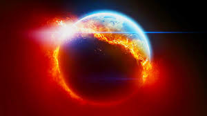

# Understanding Global Warming

## Description:
The goal of this project is to understand what Global Warming means, what are the causes and what are some effects.

We all hear that global warming is the challenge of the past, the present and the future. What does that mean? Are we close from the planet boundary? What are the causes? And what are the effects?

What will the planet look like in a decade if we don't change anything?

## Approach:

The project will have 4 parts

1. **Signs of Global warming** 

2. **The causes**
3. **The effects**
4. **Predictions**

## Resources

1. Nasa website and studies (data and infos)
2. Climate
3. Determine strategy of analysis for each variable
4. Allocate tasks and identify any dependencies
5. Plot out the sequencing of tasks as a guide in notebooks